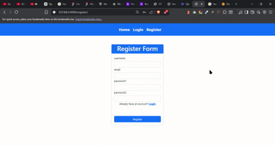
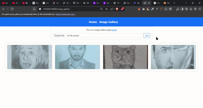

# ImageGallery App

A Django-based image gallery where users can upload, view, and manage their personal images.

## Features
- User registration and login
- Personal gallery for each user
- Upload images (JPG, PNG, GIF)
- View image details
- Delete images

## 🎥 Demo / Workflow

*Login + registration + usage process*


*Logout process*

## Installation
1. Clone repo
```bash
    git clone https://github.com/Baishant01/Django-Personal-Image-Gallery.git
    cd imagegallery
```

2. Create virtual environment
```bash
    python -m venv .env
    source .env/scripts/activate  # In bash
```

3. Install requirements
```bash
    pip install -r requirements.txt
```

5. Run migrations
```bash
    python manage.py makemigrations
    python manage.py migrate
```
6. Start server
```bash
    python manage.py runserver
```
## Technologies
- Django
- Bootstrap
- SQLite

## File Structure
ImageGallery/
├── venv/                      # Virtual environment
├── media/                     # Uploaded images
│   └── Images/                # Image files
├── ImageGalleryApp/           # Main app
│   ├── migrations/
│   ├── templates/
│   ├── __init__.py
│   ├── admin.py
│   ├── apps.py
│   ├── forms.py
│   ├── models.py
│   ├── urls.py
│   └── views.py
├── ImageGallery/              # Project folder
│   ├── __init__.py
│   ├── settings.py
│   ├── urls.py
│   └── wsgi.py
├── .env                       # Environment variables
├── .gitignore                 # Git ignore file
├── db.sqlite3                 # Database
├── manage.py
└── requirements.txt           # Dependencies